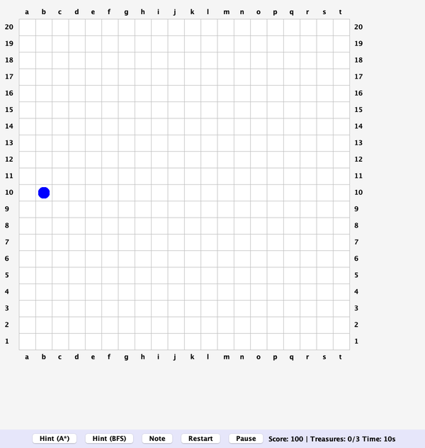

# Treasure Hunt Pathfinding

[](https://github.com/asher0913/treasure-hunt-pathfinding/actions/workflows/ci.yml)


An interactive Java Swing game that turns shortest-path search into a game mechanic. The player
explores a hidden 20×20 board, runs into obstacles, and collects three treasures. At any point
they can spend score points to ask A* or breadth-first search for the next move.



## Pathfinding

Both searches find a shortest path to the **nearest** remaining treasure on a 4-connected grid.
The hint reveals only its first step.

- **Breadth-first search** is the uninformed baseline.
- **A\*** uses the Manhattan distance to the nearest treasure. That heuristic is admissible and
  consistent, so a cell is final the first time it is expanded.
  - The treasure positions are collected once per search, not rescanned for every node.
  - Stale duplicates of an already-expanded cell are skipped when they come off the queue.
  - Ties on `f = g + h` go to the deeper node, which on open ground walks straight at the
    treasure instead of expanding a widening diamond of equal-cost cells.

Cells expanded on 1,000 seeded boards per row, starting from a corner. Rows count only boards
with a reachable treasure.

| Obstacles | Treasures | Boards | Same length as BFS | BFS | A\* | A\* before the fixes above |
|---:|---:|---:|---:|---:|---:|---:|
| 15 (the game's setting) | 3 | 997 | 997 | 99.1 | **14.2** | 46.4 |
| 15 | 1 | 994 | 994 | 194.5 | **21.9** | 101.0 |
| 80 | 3 | 911 | 911 | 79.4 | **20.2** | 43.2 |
| 80 | 1 | 898 | 898 | 153.0 | **34.2** | 81.2 |
| 140 | 1 | 445 | 445 | 105.1 | **46.8** | 92.0 |

A\* returns a path exactly as long as BFS on every board. With the game's settings it expands
about a seventh as many cells. The advantage shrinks as obstacles grow, because the Manhattan
distance increasingly underestimates the detours. The previous version re-expanded duplicate
queue entries and broke ties arbitrarily, expanding 2–5× more cells than the current one.

```bash
mvn -q compile exec:java -Dexec.mainClass=io.github.asher0913.treasurehunt.PathfindingBenchmark
```

## Game

- Hidden obstacles, revealed when you walk into them; hidden treasures.
- Score penalties for hints and collisions, a turn countdown, pause and restart.
- Chess-style coordinates (`a1`–`t20`) around the board.
- Swing updates run on the Event Dispatch Thread, and keys are bound with key bindings rather
  than focus-sensitive key listeners.

Use `W`, `A`, `S`, `D` to move.

## Run and test

Requires JDK 21 and Maven 3.9+.

```bash
mvn clean compile exec:java   # play
mvn test                      # 7 JUnit tests
```

The tests use fixed boards and seeded random ones. They check:

- both searches agree on shortest paths;
- unreachable treasures give an empty path;
- A\* expands only the cells on its path in open ground;
- A\* matches BFS length and never expands more cells, on 300 seeded boards;
- seeded boards are reproducible;
- the expansion gap holds;
- chess-style notation is correct.
